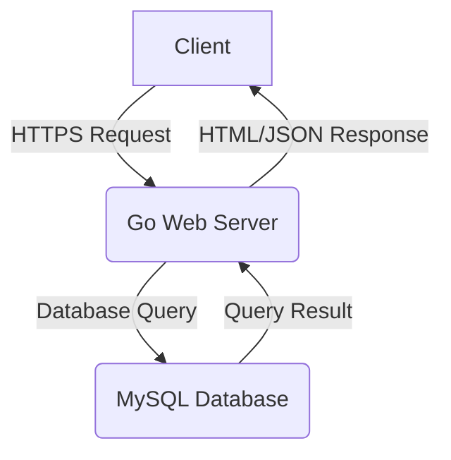

# SnippetBox: A Professional Code Snippet Manager


---

### Badges


---

## Overview

SnippetBox is a secure and efficient web application for managing and sharing code snippets. Built with Go, it offers a clean user interface and a robust backend, making it an ideal tool for developers who need to organize their code snippets effectively. The application features user authentication, session management, and a RESTful API for seamless integration with other tools.

## Features

*   **Secure User Authentication:** Sign up, log in, and manage your account securely.
*   **Snippet Management:** Create, view, and delete your code snippets with ease.
*   **Session Management:** Persistent sessions allow you to stay logged in.
*   **RESTful API:** A well-defined API for programmatic access to your snippets.
*   **Secure by Design:** Implemented with security best practices, including HTTPS and password hashing.

## Architecture

The application follows a classic client-server architecture, with a Go backend serving HTML templates and a RESTful API. The database is a MySQL instance, and communication is secured with TLS.



## Getting Started

### Prerequisites

*   Go (version 1.22 or higher)
*   MySQL

### Installation

1.  **Clone the repository:**
    ```sh
    git clone https://github.com/adcondev/snippet-box.git
    cd snippetbox
    ```

2.  **Install dependencies:**
    ```sh
    go mod tidy
    ```

3.  **Set up the database:**
    Connect to your MySQL instance and run the SQL scripts in the `/sql` directory to create the necessary tables and user.

### Usage

1.  **Configure the application:**
    Set the required environment variables, such as the database DSN. You can use the `.env.example` file as a template.

2.  **Run the server:**
    ```sh
    go run ./cmd/web -dsn="your_dsn_here"
    ```
    The server will start on `https://localhost:4000` by default.

## Contributing

Contributions are welcome! Please feel free to submit a pull request or open an issue to discuss your ideas.

## License

This project is licensed under the MIT License. See the `LICENSE` file for more details.
