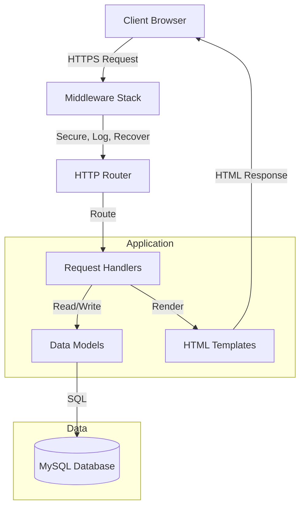

# Snippet Box

A secure, high-performance web application for organizing and sharing code snippets. Built with Go and MySQL.


[](https://goreportcard.com/report/github.com/adcondev/snippet-box)
[](https://opensource.org/licenses/MIT)
[](https://github.com/adcondev/snippet-box/actions)

## Overview

Snippet Box is a self-hosted application that allows users to paste and save text snippets (such as code blocks or configuration files) for later retrieval. It features secure user authentication, snippet expiration, and a clean, responsive interface.

## Architecture

The application follows a standard MVC-like pattern, separating the web layer (handlers/routes) from the data layer (models).


```mermaid
graph TD
    Client[Client Browser] -->|HTTPS Request| Middleware[Middleware Stack]
    Middleware -->|Secure, Log, Recover| Router[HTTP Router]
    Router -->|Route| Handler[Request Handlers]
    
    subgraph Application
    Handler -->|Read/Write| Model[Data Models]
    Handler -->|Render| Template[HTML Templates]
    end
    
    subgraph Data
    Model -->|SQL| DB[(MySQL Database)]
    end
    
    Template -->|HTML Response| Client
```

## Features

*   **Create Snippets**: Save text with a title and expiration time (1 day, 1 week, 365 days).
*   **User Accounts**: Secure signup and login functionality.
*   **View & Share**: Each snippet gets a unique permalink.
*   **Security**:
    *   HTTPS/TLS enforced.
    *   Secure session management using MySQL.
    *   Protection against XSS, CSRF, and clickjacking.
    *   Bcrypt password hashing.

## Tech Stack

*   **Backend**: Go (Golang)
*   **Database**: MySQL
*   **Router**: httprouter
*   **Session Store**: SCS (MySQL)
*   **Frontend**: Go HTML Templates, CSS

## Installation

### Prerequisites

*   Go 1.22 or higher
*   MySQL 8.0+
*   Make (optional, for running Makefile commands)

### Setup

1.  **Clone the repository:**
    ```bash
    git clone https://github.com/adcondev/snippet-box.git
    cd snippet-box
    ```

2.  **Database Setup:**
    Create a MySQL database and user, then run the SQL scripts in the `sql/` directory to create the necessary tables (`snippets`, `users`, `sessions`).
    ```sql
    source sql/create_snippetbox_db.sql;
    source sql/create_users_table.sql;
    source sql/create_snippets_table.sql;
    source sql/create_sessions_table.sql;
    ```

3.  **TLS Certificates:**
    Generate self-signed certificates for development (or use real ones for prod) and place them in a `tls/` directory:
    ```bash
    mkdir tls
    cd tls
    go run /usr/local/go/src/crypto/tls/generate_cert.go --rsa-bits=2048 --host=localhost
    ```

4.  **Configuration:**
    The application accepts command-line flags for configuration.
    *   `-addr`: HTTP network address (default ":4000")
    *   `-dsn`: MySQL data source name (e.g., `web:pass@/snippetbox?parseTime=true`)
    *   `-static-dir`: Path to static assets

## Usage

To run the application locally:

```bash
# Using Make
make run SB_ADDR=":4000" DB_DSN="web:pass@/snippetbox?parseTime=true"

# Or directly with Go
go run ./cmd/web -addr=":4000" -dsn="web:pass@/snippetbox?parseTime=true"
```

Visit `https://localhost:4000` in your browser. Note that you will need to accept the self-signed certificate warning if running in development mode.

## Contributing

Contributions are welcome! Please feel free to submit a Pull Request.

1.  Fork the project
2.  Create your feature branch (`git checkout -b feature/AmazingFeature`)
3.  Commit your changes (`git commit -m 'Add some AmazingFeature'`)
4.  Push to the branch (`git push origin feature/AmazingFeature`)
5.  Open a Pull Request
